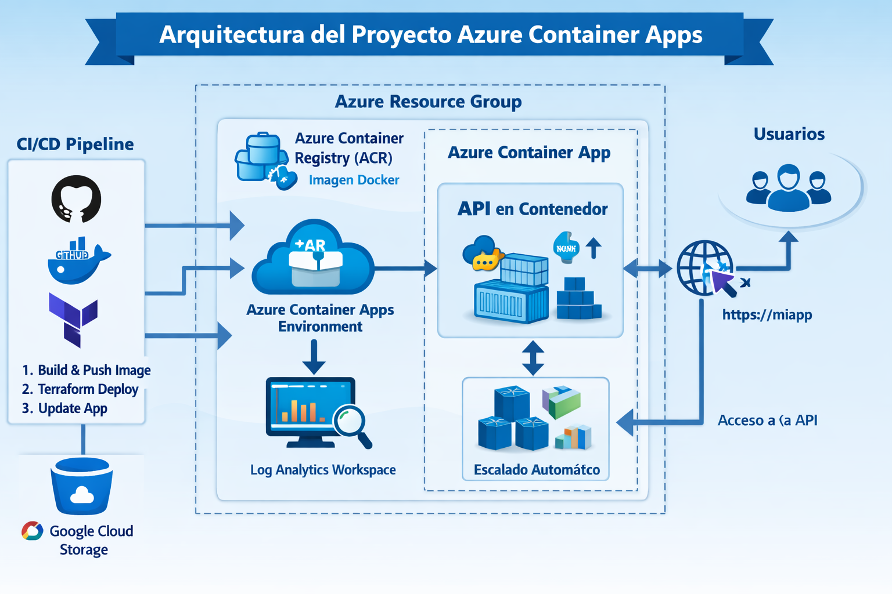

API Contenedorizada + Azure Container Apps + Terraform Multicloud
🎯 Objetivo del proyecto
Este proyecto demuestra un escenario real de modernización de aplicaciones usando contenedores y servicios serverless de Azure. La infraestructura se despliega con Terraform, utilizando Google Cloud Storage como backend remoto, mostrando un enfoque multicloud profesional.

Un reclutador podrá ver aquí:

Contenedorización de una API (Python/Node).

Construcción y publicación de imágenes en Azure Container Registry (ACR).

Despliegue de contenedores en Azure Container Apps (ACA).

Autoscaling inteligente mediante KEDA.

Observabilidad con Log Analytics.

Infraestructura modular con Terraform.

Backend remoto en GCS para estado de Terraform.

🧩 Arquitectura del Proyecto
La siguiente arquitectura resume el flujo completo del proyecto:
desde el código fuente y la construcción de la imagen Docker,
hasta el despliegue automatizado en Azure Container Apps y la observabilidad en Log Analytics.

markdown

🔧 Descripción técnica del flujo
CI/CD Pipeline

GitHub gestiona el código y los archivos Terraform.

Docker construye la imagen de la API y la publica en ACR.

Terraform despliega toda la infraestructura en Azure usando GCS como backend remoto.

Azure Resource Group

Contiene todos los recursos del proyecto: ACR, Log Analytics, ACA Environment y ACA.

Azure Container Registry (ACR)

Almacena la imagen Docker.

Permite autenticación segura y control de versiones.

Azure Container Apps Environment

Entorno donde se ejecutan los contenedores.

Integrado con Log Analytics para métricas y logs.

Azure Container App

Ejecuta la API contenedorizada.

Usa identidad administrada para autenticarse en ACR.

Expone la aplicación mediante HTTPS.

Autoscaling con KEDA

Permite escalar automáticamente según métricas como CPU, solicitudes HTTP o consultas de Log Analytics.

Log Analytics Workspace

Centraliza logs, métricas y diagnósticos del Container App.

🧱 Componentes del proyecto
Google Cloud
Google Cloud Storage (GCS)  
Backend remoto de Terraform para almacenar el estado de forma segura y versionada.

Azure
Resource Group

Log Analytics Workspace

Azure Container Registry (ACR)

Azure Container Apps Environment

Azure Container Apps

Autoscaling con KEDA

Identidad administrada + permisos AcrPull

Local
API simple (./api)

Dockerfile

Build + Push automático vía null_resource con local-exec

📂 Estructura del repositorio
text
.
├── main.tf
├── outputs.tf
├── modules/
│   ├── rg/
│   ├── log_analytics/
│   ├── acr/
│   ├── container_env/
│   └── container_app/
└── api/
    ├── Dockerfile
    └── app.py / index.js
🚀 Flujo de despliegue
1. Terraform inicializa backend en GCS
El estado se guarda en un bucket versionado.

2. Creación de infraestructura en Azure
RG → Log Analytics → ACR → ACA Environment → ACA.

3. Terraform construye y publica la imagen Docker
bash
docker build
docker tag
docker push
4. Azure Container Apps despliega la imagen
Usando identidad administrada y permisos AcrPull.

5. Autoscaling con KEDA
El entorno queda preparado para añadir triggers como:

CPU

HTTP concurrent requests

Log Analytics queries

Queue length

Cron jobs

6. Logs y métricas
ACA envía logs y métricas a Log Analytics.

🧩 Módulos Terraform
1. Resource Group
Crea el grupo de recursos base.

2. Log Analytics
Workspace para logs, métricas y diagnósticos.

3. Azure Container Registry (ACR)
Repositorio de imágenes Docker.

4. Container Apps Environment
Entorno donde viven los Container Apps.

5. Container App
Despliegue del contenedor:

Imagen desde ACR

Identidad administrada

Configuración de CPU/memoria

Registro privado con identidad

Rol AcrPull incluido

🐳 Contenedorización
En la carpeta api/ se incluye:

API simple (Python/Node)

Dockerfile

Scripts de build/push automatizados desde Terraform

Ejemplo de flujo:

bash
docker build -t imagen-plan ./api
docker tag imagen-plan registrycont2026.azurecr.io/imagen-plan:latest
docker push registrycont2026.azurecr.io/imagen-plan:latest
📈 Autoscaling con KEDA
El proyecto deja preparado el entorno para añadir triggers:

CPU

HTTP concurrent requests

Log Analytics queries

Queue length (Service Bus, Storage Queue)

Cron jobs

Esto permite escalar el contenedor sin servidores.

🔍 Observabilidad
El Container App envía logs a Log Analytics:

Logs de contenedor

Métricas de CPU/memoria

Eventos de escalado

Diagnósticos de ACA

🌐 Backend multicloud (GCP)
Terraform usa:

hcl
backend "gcs" {
  bucket      = "bucket_backend"
  prefix      = "terraform"
  credentials = "../el-plan-iac.json"
}
Esto demuestra un enfoque multicloud real, separando el estado del proveedor donde se despliega la infraestructura.

▶️ Cómo ejecutar el proyecto
1. Inicializar Terraform
bash
terraform init
2. Ver el plan
bash
terraform plan
3. Aplicar
bash
terraform apply
4. Ver outputs
bash
terraform output
